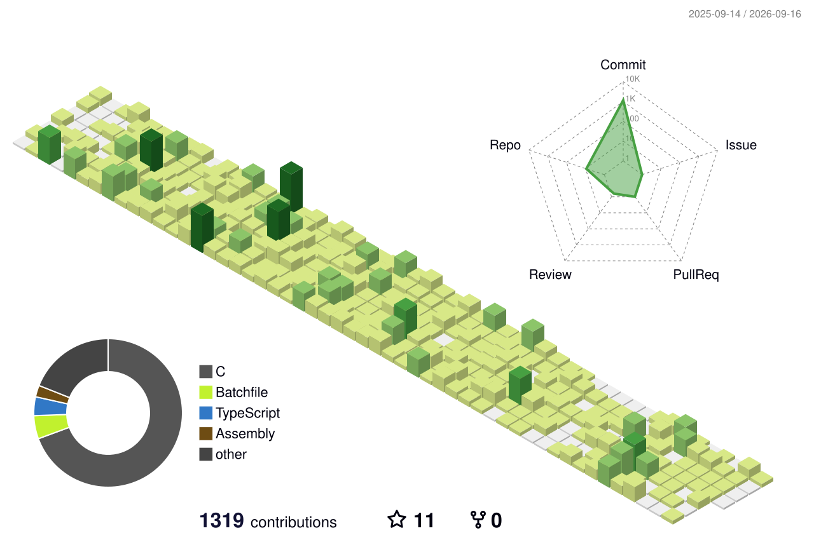

<div align="center">  </div> <h1 align="center">Gabriel Oliveira</h1> <p align="center"> <code>16 y.o • Brazil • Programmer in training</code> </p> <p align="center">  </p>

---

### `whoami`

```txt
Hi, I'm Gabriel — I like working close to the metal.
Most of my time goes into C, Assembly, and understanding
how systems actually run under the hood: kernels, shells,
compilers, and the terminal in general.
```

**Currently exploring:** kernels & operating systems, terminal tooling, and continuous learning in low-level systems.

---

### Stack

**Core**:  

**Also use**:      

**Platforms & tools**:       

---

### Projects worth a look

| Project                                                                    | Description                                    | Stack                    |
|----------------------------------------------------------------------------|------------------------------------------------|--------------------------|
| 🖥️ [**lsw-Gab-OS**](https://github.com/gabk9/lsw-Gab-OS/blob/pc-linux)     | A Linux-like shell — my biggest project so far | C                        |
| 🔤 [**C-eval**](https://github.com/gabk9/C-eval)                           | A simple but extensive interpreter             | C                        |
| 🖱️ [**Cclicker**](https://github.com/gabk9/Cclicker)                       | A small cross-platform autoclicker engine      | C                        |
| 🧮 [**BitWorkbench**](https://github.com/gabk9/BitWorkbench)               | A numeric systems workbench for low-level devs | TypeScript, VS Code Ext. |
| ⚙️ [**VSCode-Scripts**](https://github.com/gabk9/Scripts-VSCode/tree/main) | Scripts to help with compilation               | Batch, Shell, JSON       |

<p align="center"><sub>⭐ If you like what you see, consider starring some repos!</sub></p>

---

### Stats

<p align="center">
  
</p>

<p align="center">   </p> <p align="center">  </p> <div align="center"> <picture> <source media="(prefers-color-scheme: dark)" srcset="profile-3d-contrib/profile-night-green.svg" />  </picture> </div> <!-- Requires the github-profile-3d-contrib Action set up in this repo — see setup notes -->

---

### Contact

<p align="center"> <a href="mailto:giane.ga2010@gmail.com"></a> <a href="https://discord.com/users/gabirel69_"></a> <a href="https://www.instagram.com/gabriel.o.miranda"></a> <a href="https://www.linkedin.com/in/gabriel-oliveira-miranda-3b5076372/"></a> </p> <p align="center"><i>Personal website: coming soon</i></p> <p align="center"><sub>Thanks for stopping by 🐧</sub></p> <p align="center">  </p>
