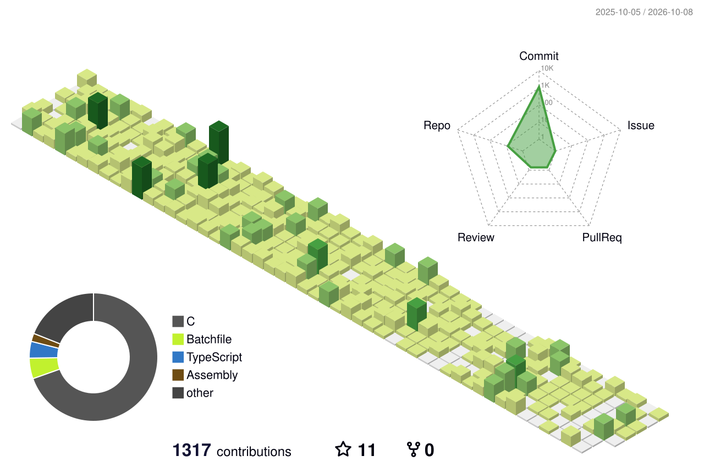

<div align="center">
  

  <h1>Gabriel Oliveira Miranda</h1>

  <code>16 y.o · 🇧🇷 Brazil · programmer in training</code>

  <br /><br />

  
  
</div>

---

### `$ whoami`

```c
// Gabriel — likes working close to the metal.
struct dev me = {
    .focus    = { "C", "Assembly" },
    .interest = { "kernels", "shells", "compilers", "the terminal" },
    .goal     = "understand how systems actually run under the hood",
    .status   = LEARNING,   /* always */
};
```

**Currently exploring:** kernels & operating systems, terminal tooling, and low-level systems in general.

---

### `$ ls ~/stack`

| | |
|---|---|
| **Core** |   |
| **Also use** |       |
| **OS** |     |
| **Tools** |       |

---

### `$ ls ~/projects`

<p align="center">
  <a href="https://github.com/gabk9/lsw-Gab-OS"></a>
  <a href="https://github.com/gabk9/C-eval"></a>
  <a href="https://github.com/gabk9/Cclicker"></a>
  <a href="https://github.com/gabk9/BitWorkbench"></a>
  <a href="https://github.com/gabk9/Scripts-VSCode"></a>
</p>

<p align="center"><sub>⭐ If something here is useful to you, a star is appreciated!</sub></p>

---

### `$ cat /proc/stats`

<p align="center">
  
  
</p>

<p align="center">
  
</p>

<!-- Requires the github-profile-3d-contrib Action in this repo (writes to profile-3d-contrib/) -->
<div align="center">
  <picture>
    <source media="(prefers-color-scheme: dark)" srcset="profile-3d-contrib/profile-night-green.svg" />
    
  </picture>
</div>

---

### `$ ./contact.sh`

<p align="center">
  <a href="mailto:giane.ga2010@gmail.com"></a>
  <a href="[discord]"></a>
  <a href="[instagram]"></a>
  <a href="[linkedin]"></a>
</p>

<p align="center"><i>Personal website: coming soon</i></p>
<p align="center"><sub>Thanks for stopping by 🐧</sub></p>


